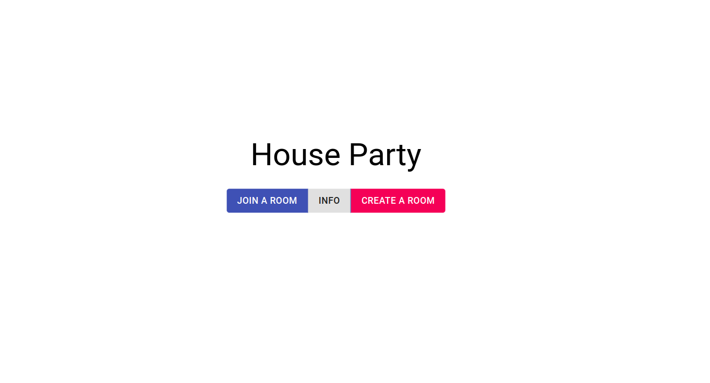
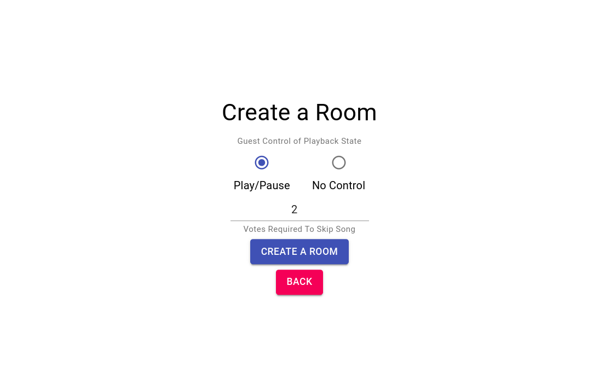
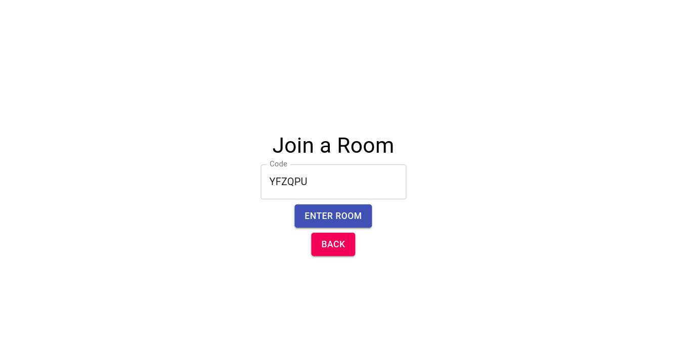
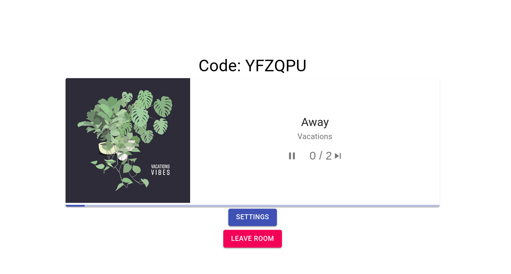
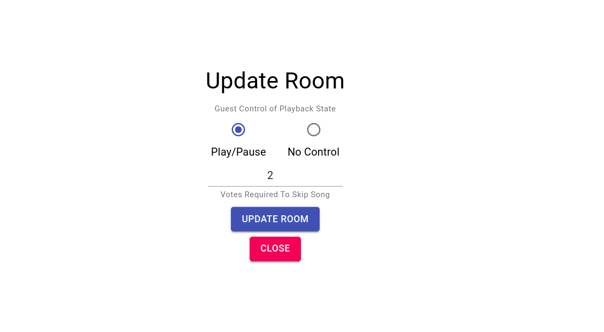
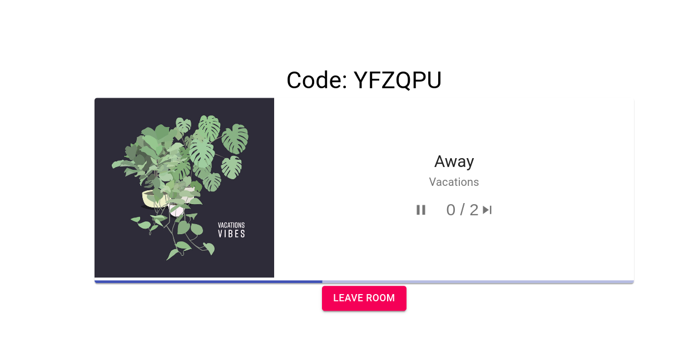

# SPartyfy - Party Music Room App

Welcome to SPartyfy! This application allows users to create and join music rooms, where they can have control on music on host's device of the party and skip song based on votes.

## Features

- Create a room and become the host to control the music playback.
- Join existing rooms to enjoy music with others.
- Collaboratively add songs to the playlist and (coming soon!!)
- Vote on skipping songs
- Seamless integration with Spotify for song playback.

## Technologies Used

- Django (Backend)
- React (Frontend)
- Spotify API (Authentication and Song Playback)
- Material-UI (UI Components)
- Axios (HTTP Requests)
- Django REST Framework (API interaction)
- PostreSQL (Databse)


## Getting Started

To run the application locally, follow these steps:

1. Clone the repository: `git clone https://github.com/your-username/my-awesome-music-room.git`
2. Navigate to the project directory.
3. Set up and activate a virtual environment (recommended): `conda envrionment`
4. Install Python dependencies: `pip install -r requirements.txt`
5. Navigate to the frontend directory: `cd frontend`
6. Install Node.js dependencies: `npm install`
7. Go to Spotify developer dashborad  `https://developer.spotify.com/dashboard`
8. Create a spotify app there and add the redirect uri: `http://127.0.0.1:8000/spotify/redirect`
9. Create a credential.py file inside spotify/api and add 
```python
    CLIENT_ID = "XXXXXXXXXXXXXXXXXXXXXXXX"
    CLIENT_SECRET = "XXXXXXXXXXXXXXXXXXXXXXXX"
    REDIRECT_URI = "http://127.0.0.1:8000/spotify/redirect"
```
10. Start the development server: `npm run dev`
11. ### Setting Up PostgreSQL Database

    1. Install PostgreSQL.
    2. Create a Database.
    3. Create a Database User: While still in the PostgreSQL console, create a new user and set a password for them:
    4. Grant Database Privileges: Grant necessary privileges to the user for the database:

    5. Update Django Settings: Open the `settings.py` file in your Django project and locate the `DATABASES` section. Replace the existing configuration with the PostgreSQL configuration:
        ```python
        DATABASES = {
            'default': {
                'ENGINE': 'django.db.backends.postgresql_psycopg2',
                'NAME': 'myproject',
                'USER': 'myprojectuser',
                'PASSWORD': 'password',
                'HOST': 'localhost',
                'PORT': '5432',
            }
        }
        ```
    6. Migrate Database
    7. Run the Application: Start the development server by running:

        ```
        python manage.py runserver
        ```
    8. Access the Application: Open a web browser and go to `http://localhost:8000` to access your My Awesome Music Room App.

## UI Screenshot 
### Homepage:


### CreateRoom:


### JoinRoom:


### HostRoom:


### Setting:


### UserPage:


## Contributing

We welcome contributions from the community! If you'd like to contribute, please follow these steps:

1. Fork the repository.
2. Create a new branch for your feature: `git checkout -b my-feature`
3. Make your changes and commit them: `git commit -m "Add new feature"`
4. Push your branch to your fork: `git push origin my-feature`
5. Open a pull request on GitHub.


## Acknowledgements
- Special thanks to Tech With Tim youtube channel.
- Shoutout to the developers of the libraries and tools used in this project.

---

Feel free to update the content and structure of this `README.md` file to best suit your project and provide all the necessary information for users and contributors.
